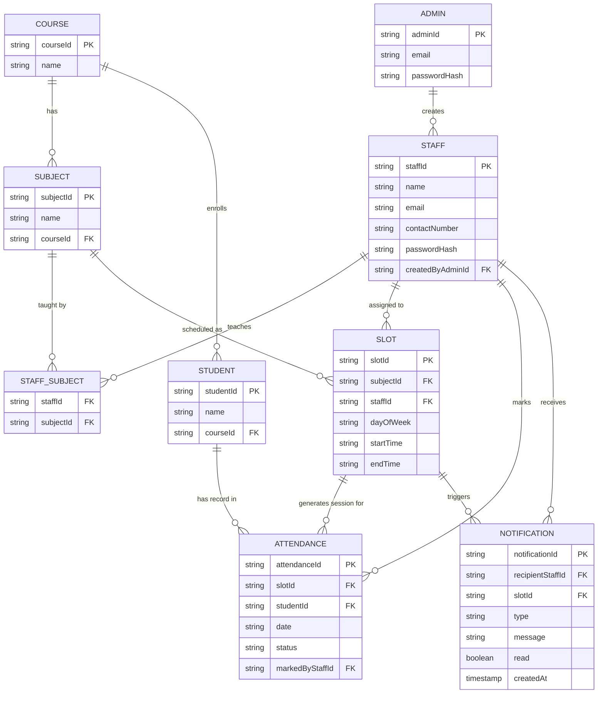
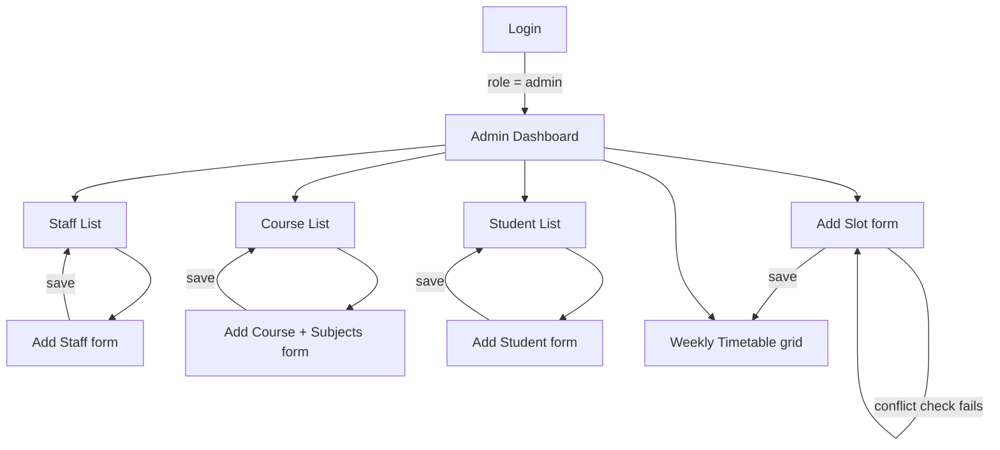
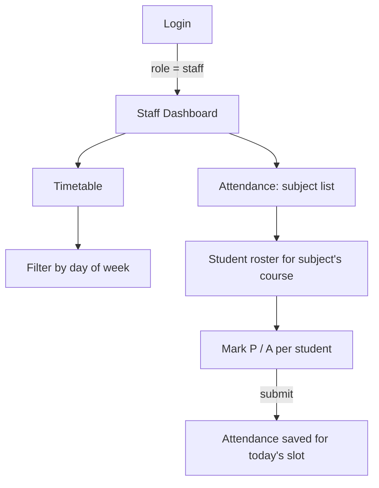
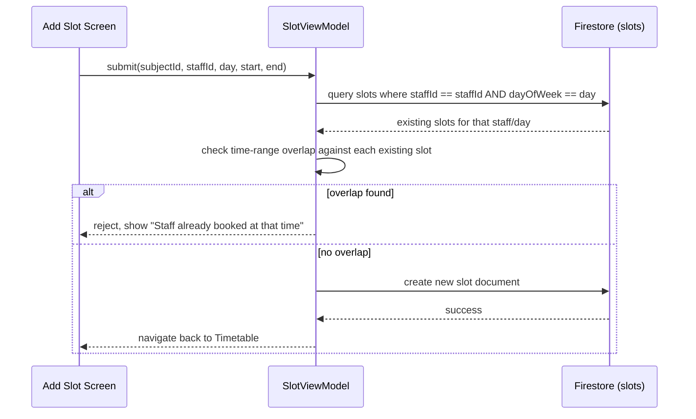
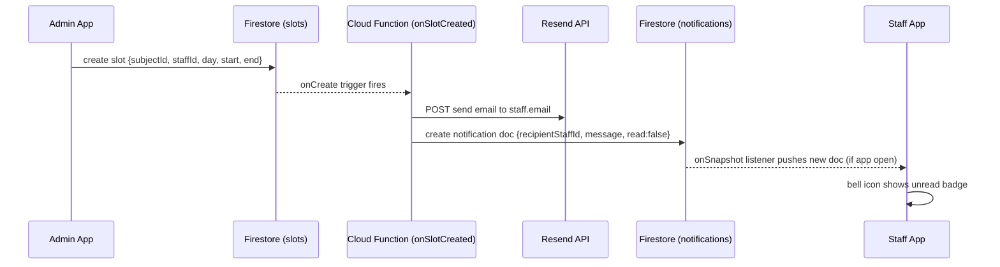
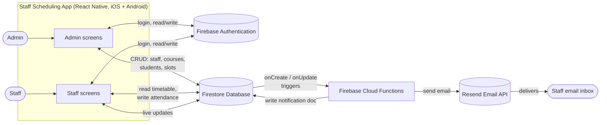
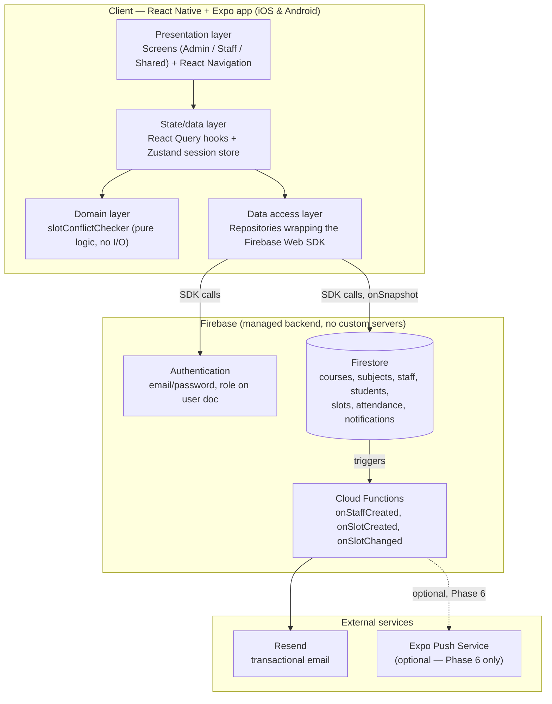

# Staff Scheduling Android App — System Design

## 1. Tech Stack (cross-platform: iOS + Android from one codebase)

| Layer | Choice | Notes |
|---|---|---|
| Framework | React Native + Expo (managed) | Fastest cross-platform setup: `npx create-expo-app`, runs immediately in the Expo Go app on your phone, no Xcode/Android Studio native config needed to start |
| Language | TypeScript | Type safety across the data model (Staff, Course, Subject, Student, Slot, Attendance) |
| UI kit | React Native Paper | Material components out of the box — data tables, list items, FAB — good fit for the CRUD-heavy admin screens and the weekly timetable grid |
| Navigation | React Navigation (native-stack) | Role-based navigator: `AdminNavigator` / `StaffNavigator` chosen after login |
| State/data | React Query (`@tanstack/react-query`) over Firestore reads/writes, plus lightweight Zustand store for auth/session state | Keeps Firestore calls out of components, gives caching + refetch for free |
| Auth | Firebase Auth — **Web SDK** (`firebase`, not `@react-native-firebase`) (email/password) | Pure JS, no native modules, works in plain Expo Go. Role stored on the user's Firestore doc |
| Database | Firebase Firestore — **Web SDK**, modular v9+ | Cloud-hosted, so Admin's changes (new slot, new staff) are visible on Staff devices on both platforms without a custom backend |
| Backend logic | **Firebase Cloud Functions** (Node.js/TypeScript) | The one piece that has to be server-side: sending email and (later) push. Client apps can't hold email-provider API keys safely |
| Email delivery | **Resend** (or SendGrid) via a Cloud Function | Called from Cloud Functions only, HTTP API + API key, no SMTP config |
| In-app alerts | Firestore `notifications` collection + `onSnapshot` listener | Realtime, foreground-only, zero extra native setup — fits the Expo Go-compatible MVP |
| Storage | Firebase Storage (optional) | Only if staff/student photos are added later — not in current spec |

**Why the Web SDK over `@react-native-firebase` here:** you asked for easy setup, and the web SDK is pure JavaScript — it runs in plain Expo Go with zero native config, so there's no EAS Dev Client build standing between you and a running app. The tradeoff is weaker offline caching and no true push notifications (device-closed alerts) — neither is in your current feature list. If you add push later (§6), that phase alone will need a Dev Client build; everything else in this plan stays on Expo Go. Firestore is still preferred over Realtime Database because the data is naturally tabular/collection-shaped and Firestore's query filtering (`where('staffId', '==', ...)`, `where('dayOfWeek', '==', ...)`) is what the conflict-check rule (§6) depends on.

## 2. Features (from spec, organized into modules)

### Admin

- Login (email/password, account pre-seeded — no self-registration)
- Dashboard: Staff, Courses, Students, Slots, Timetable
- Staff: list, add (name, email, contact, password, assigned subjects), delete
- Courses: list, add (course name + its subjects)
- Students: list, add (name, enrolled course)
- Slots: add (subject, staff, day of week, start/end time) — **rejected if the staff member is already booked in an overlapping slot**
- Timetable: read-only weekly grid view (all slots, sortable by day)

### Staff

- Login (only accounts created by Admin; no self-registration)
- Dashboard: Timetable, Attendance
- Timetable: own subjects → slots, filterable by day of week
- Attendance: own subjects → student roster (of the subject's course) → mark Present/Absent → save

### Notifications (email + in-app, both roles)

- **Staff account created** → welcome email to the new staff member with a secure "set your password" link (never a plaintext password by email)
- **New slot assigned to a staff member** → email + in-app alert: "New class scheduled: {subject} — {day} {startTime}–{endTime}"
- **Slot changed/removed** → email + in-app alert to the affected staff member
- In-app: a notification bell on both dashboards, backed by a live Firestore listener, with unread count and mark-as-read
- All of the above work with the app in the foreground (Expo Go-compatible); true "alert while app is closed" push notifications are an optional later phase — see §8, Phase 6

## 3. Database Design

### 3.1 Entity-Relationship Diagram



### 3.2 Field notes / rules derived from the spec

- **Course → Subject is 1-to-many.** ("Course: Java, Subjects: Core Java, Advance Java")
- **Staff ↔ Subject is many-to-many** via `STAFF_SUBJECT` — a staff member is assigned one or more subjects at creation time; a subject can (in principle) have more than one qualified staff member, but only one is *scheduled* per slot.
- **Student → Course is many-to-1.** Students enroll in a course; attendance for a subject session pulls the roster from that subject's parent course.
- **Slot is the timetable row**: `(subjectId, staffId, dayOfWeek, startTime, endTime)`. This is where the "Excel sheet" weekly view (spec §2, §4) is read from — group slots by `dayOfWeek`, sort by `startTime`.
- **Attendance is per Slot + date + student**, so the same subject on different days produces separate attendance records, and a staff member can only mark attendance for slots assigned to them.

### 3.3 Firestore collection layout

Firestore is document/collection-based, not relational, so the ER model above maps to top-level collections with foreign keys as plain ID fields (no native joins — queries filter by field):

```text
/users/{uid}                 { role: "admin" | "staff", staffId? }
/staff/{staffId}             { name, email, contactNumber, subjectIds: [subjectId] }
/courses/{courseId}          { name }
/subjects/{subjectId}        { name, courseId }
/students/{studentId}        { name, courseId }
/slots/{slotId}              { subjectId, staffId, dayOfWeek, startTime, endTime }
/attendance/{attendanceId}   { slotId, studentId, date, status, markedByStaffId }
/notifications/{notificationId} { recipientStaffId, slotId, type, message, read, createdAt }
```

`users/{uid}` is the join between Firebase Auth's UID and app role — on login, read this doc first to decide whether to route into the Admin graph or Staff graph. Admin accounts are seeded directly in Firestore/Auth (matches "Admin can only login with an already-existing id"); Staff docs are created by the Add Staff screen, which also calls `Auth.createUserWithEmailAndPassword` so the new staff member can log in immediately.

## 4. Screens / UI Flow

### 4.1 Admin flow



### 4.2 Staff flow



## 5. Conflict Rule (the one hard business rule in the spec)

> "Subject will be allotted only if staff is available on that time for the particular subject."

Sequence when Admin submits **Add Slot**:



Overlap test: two ranges `[s1,e1)` and `[s2,e2)` conflict iff `s1 < e2 AND s2 < e1`. Run this client-side before write, and optionally re-validate in a Firestore Cloud Function if you want to guard against race conditions from concurrent admins.

## 6. Notifications (Email + In-App Alerts)

Email can only be sent from a trusted server, never from the client app (that would mean shipping an email-provider API key inside the app bundle). So notifications are Cloud-Function-driven: a Firestore write triggers a function, which does two things in parallel — sends the email, and writes an in-app notification doc the client is already listening to.



The same pattern covers the "staff account created" welcome email (`onCreate` trigger on `/staff/{staffId}`) and "slot changed/removed" (`onUpdate`/`onDelete` triggers on `/slots/{slotId}`).

**Setup cost, honestly stated:** Cloud Functions that make outbound HTTP calls (to Resend/SendGrid) require the Firebase **Blaze** (pay-as-you-go) plan instead of the free Spark plan — this is a one-time account setting, not a recurring cost at this app's scale (Firebase's free tier allowances still apply on Blaze; you're only billed if you exceed them, which a scheduling app for one institution won't). Sending to real inboxes also requires verifying a sending domain with Resend (a one-time DNS step) — during development you can send to your own verified test address without this.

**Deferred for later (not in MVP):** true push notifications, i.e. an alert that appears even when the app is closed/backgrounded. That needs `expo-notifications` + device push tokens, which requires an EAS Dev Client build — the one piece of native tooling this plan otherwise avoids. See Phase 6 in §8.

## 7. System Diagram & Architecture

### 7.1 System diagram (context view)

Who talks to what, at the level of whole systems — this is the picture to
show someone who wants to understand the app without reading code.



Everything the app does flows through Firestore as the single source of
truth: Admin writes create data, Staff reads it (and writes attendance
back), and any write that matters to a staff member (new slot, changed
slot, new account) fans out to email + in-app notification through Cloud
Functions — nothing talks to Resend except the backend.

### 7.2 System architecture (layered view)

How the app is put together internally, and how that maps onto Firebase's
managed services rather than a custom backend.



This is a serverless architecture end to end — there's no app-managed
server process; Firebase's Auth, Firestore, and Cloud Functions are the
entire backend, which is what keeps setup to "create a Firebase project"
rather than "provision and operate a server."

### 7.3 Module structure

```text
src/
├── models/                  # Staff, Course, Subject, Student, Slot, Attendance, Notification TS types
├── data/
│   ├── repositories/         staffRepository, courseRepository, subjectRepository,
│   │                          studentRepository, slotRepository, attendanceRepository,
│   │                          notificationRepository (thin wrappers around the Firebase Web SDK)
│   └── queries/               React Query hooks: useStaffList, useSlots, useAttendance, ...
│                               + useNotifications (live onSnapshot subscription)
├── domain/
│   └── slotConflictChecker.ts # pure function, unit-testable in isolation (Jest)
├── screens/
│   ├── auth/                  LoginScreen
│   ├── admin/                  DashboardScreen, StaffListScreen, AddStaffScreen,
│   │                            CourseListScreen, AddCourseScreen, AddStudentScreen,
│   │                            AddSlotScreen, TimetableScreen
│   ├── staff/                   StaffDashboardScreen, StaffTimetableScreen,
│   │                             AttendanceSubjectListScreen, AttendanceMarkScreen
│   └── shared/                  NotificationsScreen (bell icon target, both roles)
├── navigation/                 RootNavigator (role-gated: AdminNavigator / StaffNavigator)
├── store/                       useAuthStore (Zustand) — session, role, current user
└── App.tsx

functions/                    # Firebase Cloud Functions (Node.js/TypeScript), deployed separately
├── src/
│   ├── onStaffCreated.ts      Firestore trigger → welcome email (password-set link)
│   ├── onSlotCreated.ts       Firestore trigger → email + notification doc
│   ├── onSlotChanged.ts       Firestore trigger (update/delete) → email + notification doc
│   └── lib/emailClient.ts     Resend API wrapper
└── package.json
```

`slotConflictChecker.ts` stays a pure function with no Firestore/React imports so it can be unit-tested directly with Jest, independent of the UI or network layer.

## 8. Development Plan (phased)

| Phase | Scope | Deliverable |
|---|---|---|
| 0 | Project scaffold: `npx create-expo-app` (TS template), React Navigation + React Native Paper + React Query + Zustand installed, Firebase project created (Auth + Firestore + Functions enabled, Blaze plan), Firebase Web SDK config wired | App runs in plain Expo Go, empty login screen |
| 1 | Auth + role routing | Login screen, `users/{uid}` role lookup, `AdminNavigator` vs `StaffNavigator` |
| 2 | Admin CRUD: Staff, Course, Subject, Student | List + Add screens for each, backed by Firestore |
| 3 | Slot scheduling + conflict rule | Add Slot screen, `slotConflictChecker`, weekly Timetable grid |
| 4 | Staff timetable + attendance | Staff dashboard, timetable filtered to own subjects, attendance marking flow |
| 5 | Notifications | `functions/` deployed, Resend account + verified sender, email on staff-created/slot-created/slot-changed, in-app notification bell + list screen |
| 6 (optional) | True push notifications (alerts when app is closed) | `expo-notifications` + EAS Dev Client build, store Expo push tokens per user, Cloud Functions call Expo's Push API instead of/alongside the in-app doc |
| 7 | Polish | Delete staff, edit flows, empty/error states, basic input validation, loading skeletons |

Recommend building Phase 0–1 first and confirming Firebase project setup (you'll need a Google account for the Firebase console, the Blaze billing plan enabled for Cloud Functions, and a Resend/SendGrid account for email — I can't provision any of these — before I scaffold further phases). Phase 6 additionally needs an Apple Developer account once you're ready for iOS Dev Client / TestFlight builds.

**Note on Expo Go**: Phases 0–5 run entirely in the standard Expo Go app — no custom native build required. Only Phase 6 (true push) needs an EAS Dev Client build, and only for that phase.

## 9. Open questions worth deciding before Phase 2

1. **Staff deletion**: cascade-delete their slots/attendance, or block deletion if they have scheduled slots?
2. **Subject reassignment**: can a slot's staff be changed after creation, or is it delete-and-recreate only?
3. **Attendance edit window**: can staff amend attendance after the day it was taken, or is it locked once submitted?
4. **Notification retention**: auto-delete/archive read notifications after N days, or keep indefinitely?

These aren't blocking — sensible defaults (cascade-delete, edit-only-same-day, keep indefinitely for now) can be assumed and revisited later.
